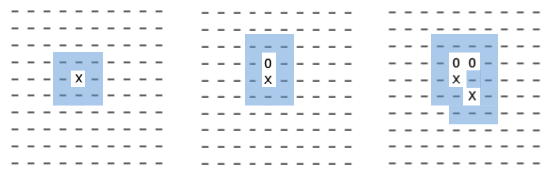

# Toteutusdokumentti

## Ohjelman yleisrakenne

````
.
├── checkstyle.xml
├── mysuppressions.xml
├── nbactions.xml
├── nbproject
│   └── project.properties
├── pom.xml
└── src
    ├── main
    │   ├── java
    │   │   └── tictactoe
    │   │       ├── ai
    │   │       │   └── AI.java
    │   │       ├── data
    │   │       │   └── MoveList.java
    │   │       ├── game
    │   │       │   ├── Board.java
    │   │       │   ├── Game.java
    │   │       │   ├── Move.java
    │   │       │   ├── Player.java
    │   │       │   └── UI.java
    │   │       └── main
    │   │           └── Main.java
    │   └── resources
    └── test
        └── java
            ├── AITest.java
            ├── BoardTest.java
            ├── GameTest.java
            ├── MoveListTest.java
            ├── MoveTest.java
            └── PlayerTest.java
````


Ohjelma sisältää neljä pakettia: `ai`, `data`, `game` ja `main`. 

### AI
`ai`-paketti sisältää AI-luokan, joka toteuttaa pelin tekoälyn. Luokka pitää sisällään metodin siirron hakemiseen tekoälyltä, itse algoritmin toteutuksen sekä algoritmiin liittyviä apumetodeja. 

### Data
`data`-paketti sisältää luokan MoveList, joka on oma toteutus korvaamaan Javan ArrayList. MoveListiä käytetään nimensä mukaisesti Move-olioiden varastointiin. MoveListiä käyttää ainoastaan AI-luokka ja se on tukirakenne algoritmin toiminnalle.

### Game
`game`-paketti sisältää kaiken itse peliin ja sen käyttöliittymään liittyvät luokat.

#### Board
Board-luokka toteuttaa pelin laudan eli ruudukon. Luokka tarjoaa metodit laudan alustamiseen, tulostamiseen ja kopiointiin. Luokka pitää lisäksi sisällään metodeja siirtojen validointin ja voittosuoran etsimiseen.

#### Game
Game-luokka on vastuussa pelimekaniikasta ja -logiikasta. Se pitää kirjaa mm. pelaajista, pelivuorosta, viimeisimmästä siirrosta ja siirtojen yhteismäärästä. Siinä on myös viitteet pelikohtaisiin Board- ja UI-luokkien instansseihin. Game-luokka tarjoaa metodit pelin aloittamiseen, pelin asetuksien määrittelyyn (ruudukon koko, voittosuoran pituus, pelimoodi) sekä siirtojen validoimiseen ja pelin loppumisen tarkistamiseen yhdessä Board-luokan kanssa.

#### Move
Move-luokka on tietorakenne, johon varastoidaan siirto. Siirrolla on kolme ominaisuutta: rivikoordinaatti, sarakekoordinaatti sekä arvo. Move-olioita käytetään siirtojen indikoimiseen pelissä, jolloin arvolla eli score-attribuutilla ei ole ns. käyttöä, mutta AI-luokan algoritmi käyttää score-attribuutteja laskennan tuloksen varastointiin.

#### Player
Player-luokan ilmentymään voidaan tallentaa pelaaja, tieto pelaajan käyttämästä merkistä (X/O) ja ihmispelaajan tapauksessa viite pelin UI:hin ja AI-pelaajan tapauksessa viite AI:hin. Luokka tarjoaa metodin siirron hakemiseen, jolloin ihmispelaajan ollessa kyseessä pyydetään UI:ta hankkimaan siiro käyttäjältä ja AI-pelaajan ollessa kyseessä kutsutaan AI:n siirto-metodia.

#### UI
UI-luokka on vastuussa konsoli-UI:n tulostuksista ja tiedon hakemisesta käyttäjältä. Se kerää tiedon käyttäjältä liittyen pelin alkuasetuksiin ja siirtoihin sekä hoitaa pelin kuluessa etenemisen tulostamisen konsoliin.

### Testit

Luokkakohtaiset yksikkötestit sijaisevat samassa paketissa polussa *src/test/java*.

## Saavutetut aika- ja tilavaativuudet

Pelin tekoäly on toteutettu alpha-beta-karsintaa tekevällä minmax-algoritmilla. Alpha-beta-karsinnan lisäksi algoritmin toimintaa on pyritty optimoimaan rajoittamalla algoritmin hakusyvyyttä sekä rajaamalla ruutuja, joille laskenta suoritetaan. AI ylläpitää listaa potentiaalisista siirroista, jotka koostuvat yhden ruudun päässä jo pelatuista ruuduista olevista ruuduista (ks. kuva alla).



Alpha-beta-minmaxin huonoin mahdollinen aikavaativuus on O(b<sup>d</sup>) ja parhaan tapauksen aikavaativuus  O(√b<sup>d</sup>) (b = haarojen määrä solmussa, d = syvyys). Toteutuksessa on hieman pyritty rajoittamaan hakupuun syvyyttä (vakio 5) sekä haarojen määrää solmussa (vain pelattua aluetta lähinnä olevat ruudut). 

## Työn mahdolliset puutteet ja parannusehdotukset
Olisin ideaalisti halunnut vielä jonkin verran refaktoroida koodia, erityisesti AI-luokan minmaxAB-metodia, joka jäi nyt hieman pitkäksi ja toisteiseksi.

## Lähteet
- https://en.wikipedia.org/wiki/Alpha%E2%80%93beta_pruning