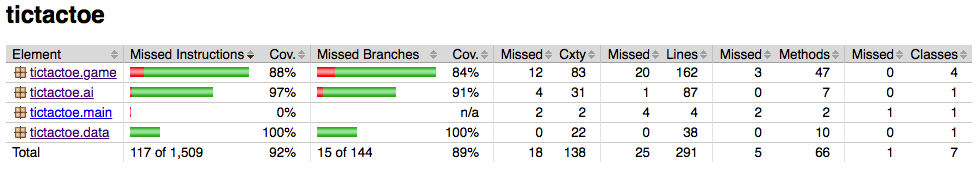
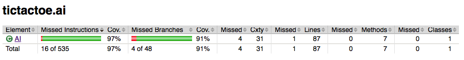
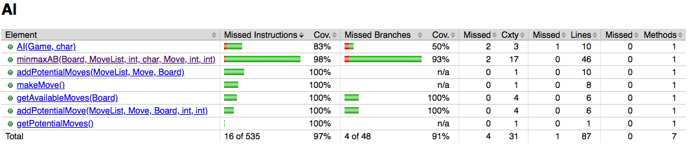
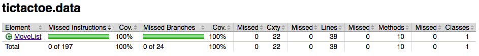
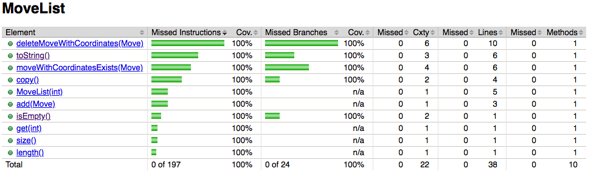
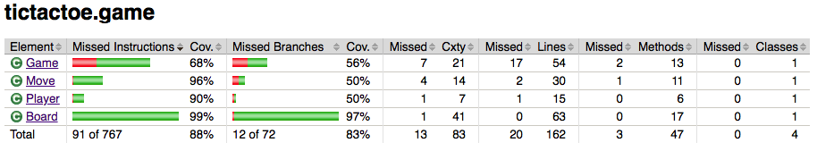
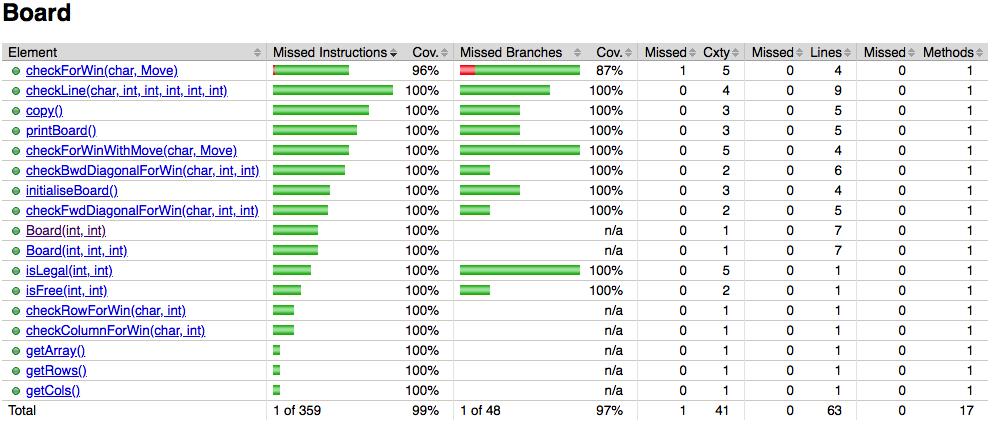
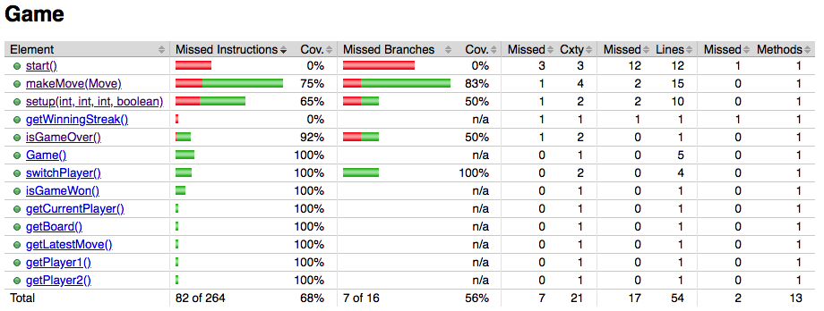
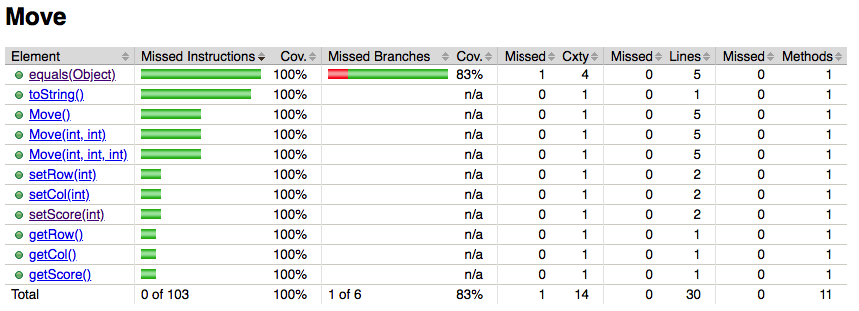
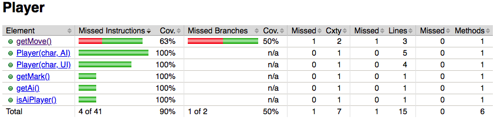

# Testausdokumentti

Ohjelman testaus on toteutettu JUnit-yksikkötestein ja manuaalisesti.

### Automaattisten testien ajaminen
Testit suoritetaan Maven-projektin juuressa eli polussa */tictactoe* komennolla:

```
mvn test
```

Testikattavuusraportti luodaan komennolla:

```
mvn jacoco:report
```

Kattavuusraporttia voi tarkastella avaamalla selaimessa tiedoston *target/site/jacoco/index.html*.

## Yksikkötestaus



JUnit-testejä on luotu luokille AI, MoveList, Board, Game, Move ja Player. UI-luokka jätettiin automaattisten testien ulkopuolelle, sillä sen toiminnallisuus koostuu lähinnä konsoli-UI:n tulosteista. Ohjelman testikattavuus on 92% (haaraumat 89%). 

### AI-paketti





AI-luokan testit testaavat, että algoritmi löytää voittavan siirron. Tekoälyä testataan muutaman yksinkertaisen, 3x3 ruudukkoon annetun pelitilanteen avulla, joissa on vain yksi tekoälyn kannalta looginen, voittoon johtava siirto. Luokan testikattavuus on 97% (haaraumat 91%).

### Data-paketti





MoveList-luokan testit testaavat luokan kaikkia toiminnallisuuksia: lisäämistä, hakemista, tyhjyyden tarkistamista, kokoa, kopiointia ja tiettyjen Move-objektien hakua/tarkistamista ja poistamista. Luokan testikattavuus on 100% (haaraumat 100%).

### Game-paketti





Board-luokan testit testaavat laudan alustamisen ja kopioinnin. Validointi ja voittavan suoran löytäminen testataan välillisesti Game-luokan testien kautta. Luokan testikattavuus on 99% (haaraumat 97%).



Game-luokan testit testaavat, että pelimekaniikka toimii oikealla tavalla: esim. siirtojen laillisuus, erilaisten voittosuorien löytäminen, vuoronvaihto ja pelin päättyminen silloin kuin laudalla on voittava suora tai kun peli päättyy tasan eli kun lauta on täynnä. Luokassa ei ole testejä metodille start(), sillä se koostuu UI-luokan ohjaamisesta ja tuottaa vain konsolitulosteita. Luokan testikattavuus on 68% (haaraumat 56%).



Move-luokan osalta testataan vain itsetoteutettua equals()-metodia, jonka avulla Move-luokan ilmentymät katsotaan samaksi jos niillä on samat koordinaatit. Luokan gettereitä ja settereitä testataan välillisesti muiden luokkien testien kautta. Luokan testikattavuus on 100% (haaraumat 83%).



Player-luokan testit testaavat, että AI-pelaajalta saadaan siirto ja että Player-luokan ilmentymästä saadaan selville onko pelaaja ihminen vai tekoäly. Haaraumakattavuus on huono sen vuoksi että getMove()-metodin käyttäjältä haettavaa siirtoa ei pystynyt testaamaan. Luokan testikattavuus on 90% (haaraumat 50%).


## Manuaalinen testaus

Etenkin AI-luokkaa ja tekoälyn toimintaa on hankalaa testata yksikkötestein. Olen ensijaisesti testannut tekoälyn toimintaa manuaalisesti. Tekoälyä on testattu eri kokoisilla ruudukoilla ja eri pituisilla voittosuorilla. Olen pyrkinyt kokeilemaan erilaisia avauksia ja pelityylejä. Tällä menetelmällä olen havainnut algoritmin toiminnassa ongelmia ja saanut ne korjatuksi. Tällä hetkellä oman testailuni perusteella tekoäly toimii kohtuullisen hyvin. Olen testannut manuaalisesti myös sovelluksen konsolikäyttöliittymää ja havainnut sen toimivaksi.

Siinä missä yksikkötestit ovat helposti toistettavissa, tämän tyylisen testaamisen toistaminen täsmälleen samalla tavalla on vaikeaa. On siis hyvin mahdollista että etenkin tekoälyä testatessa jokin yhdistelmä ruudukon kokoa, voittosuoraa ja pelistrategiaa on jäänyt kokeilematta.